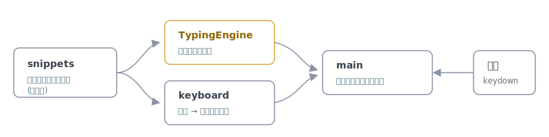

# uchikomi

[](https://github.com/miruky/uchikomi/actions/workflows/ci.yml)
[](https://www.typescriptlang.org/)
[](https://vitest.dev/)
[](https://opensource.org/licenses/MIT)

**各プログラミング言語の関数や構文を、画面の仮想キーボードを見ながら打ち込むタイピングゲームです。**

## 概要

言語を選ぶと、その言語で頻出する関数呼び出しや構文が一行ずつ出題されます。打つべき次の文字に合わせて画面下の仮想キーボードが光り、必要ならShiftも案内します。記号の多いコードを、運指を確かめながら速く正確に打つ練習に向いています。打鍵ごとにWPMと正確性が更新され、一巡するとまとめが出て、言語ごとの自己ベストが手元に残ります。収録言語は Python・TypeScript・Go・Rust から C++・C#・Kotlin・Swift・PHP まで15種類です。

出題内容はデータとして言語別に持っており、言語や項目を足すのはその配列に追記するだけです。あらゆる言語の全関数を一度に網羅することはできないため、各言語の代表的な書き方を起点に、増やしやすい構造そのものを設計に据えています。

遊ぶ: https://miruky.github.io/uchikomi/

## 使い方

- 上部のタブで言語を選びます。選んだ言語はURL(`?lang=...`)に残るので、その状態のまま共有できます
- 表示された一行を、実際のキーボードで打ちます。次に打つ文字は仮想キーボード上で光ります
- 誤った文字は赤く表示され、ミスとして数えられます。Backspaceで戻れます
- 一行打ち終えると次の行へ進み、全行を終えるとWPMと正確性のまとめが出ます。記録はその言語の自己ベストと比べられます
- まとめでは、その回に打ち間違えの多かった「苦手なキー」も上位から示されます
- Escでいつでも最初からやり直せます。まとめの画面ではEnterかスペースでもう一度始まります
- 右上のボタンで配色を「自動・ライト・ダーク」に切り替えられます
- スマートフォンでは画面に触れるとソフトキーボードが開き、そのまま打てます

## アーキテクチャ



打鍵判定と統計を担う `TypingEngine`、文字から押すべきキーを導く `keyboard`、出題データの `snippets` を分け、`main` がそれらを使って画面とキーボードを描き、入力を流し込みます。自己ベストの保存(`records`)、テーマ切替(`theme`)、URLへの言語保存(`share`)も小さな独立モジュールに切り出しました。判定・統計・運指案内・記録・テーマ・共有はいずれもDOM非依存の純粋なロジックとしてテストしています。物理キーボードは `keydown` で、スマートフォンのソフトキーボードは隠し入力欄の `beforeinput` で受け、同じ判定経路に合流させます。

## 技術スタック

| カテゴリ | 技術 |
|:--|:--|
| 言語 | TypeScript 5(strict) |
| ビルド | Vite |
| テスト | Vitest(39テスト) |
| リンタ | ESLint + Prettier |
| CI / CD | GitHub Actions |
| 配信 | GitHub Pages |
| 実行時依存 | なし |

## プロジェクト構成

- `src/snippets.ts` — 言語ごとの出題データ(拡張点)
- `src/engine.ts` — 打鍵の進行判定とWPM・正確性の算出
- `src/keyboard.ts` — キー配列と、文字から押すキー・Shiftの導出
- `src/records.ts` — 言語別の自己ベストをlocalStorageに保存
- `src/stats.ts` — 1回のプレイの誤打集計(苦手なキーの算出)
- `src/theme.ts` — 自動・ライト・ダークのテーマ切替
- `src/share.ts` — 選んだ言語をURLクエリに保存・復元
- `src/main.ts` — 画面・仮想キーボードの描画と入力処理
- `docs/architecture.svg` — アーキテクチャ図

## はじめ方

### 前提条件

- Node.js 20 以上

### セットアップ

```bash
git clone https://github.com/miruky/uchikomi.git
cd uchikomi
npm install
npm run dev
```

### テストの実行

```bash
npm test
```

### Lintの実行

```bash
npm run lint
```

### デプロイ

`main` ブランチへのプッシュで GitHub Actions がビルドし、GitHub Pages へ配信します。

## 設計方針

- **判定ロジックの分離** — 進行・統計・運指案内・記録・テーマ・共有をDOM非依存にし、テストで担保する
- **データ駆動の出題** — 言語と項目をデータに集約し、追記だけで増やせる
- **運指まで案内** — 次の文字に対応する物理キーとShiftの要否を示し、記号の多いコードでも迷わない
- **US配列前提の素直な実装** — Shift記号は基底キーへ対応づけ、案内を単純に保つ
- **入力経路の一本化** — 物理キーボードとソフトキーボードを別々に受けたあと、同じ判定関数へ合流させ、二重に数えない
- **状態の持ち越し** — 自己ベストはlocalStorage、言語選択はURLに保存し、再訪と共有で復元する
- **罫線と余白で構成する** — 箱と影を重ねず、1pxの罫線と余白で領域を分ける。配色は温度のある中立色に琥珀のアクセント1色で、自動・ライト・ダークを切り替えられる

## 制約

US配列を前提としています。日本語入力やデッドキーは扱わず、出題は各言語の代表的な一行です。実在する全言語・全関数を網羅するものではありません。スマートフォンの画面キーボードには対応しますが、練習の主眼は物理キーボードに置いており、日本語IMEが有効なままだと入力を取り込めないことがあります。

## ライセンス

[MIT](LICENSE)
